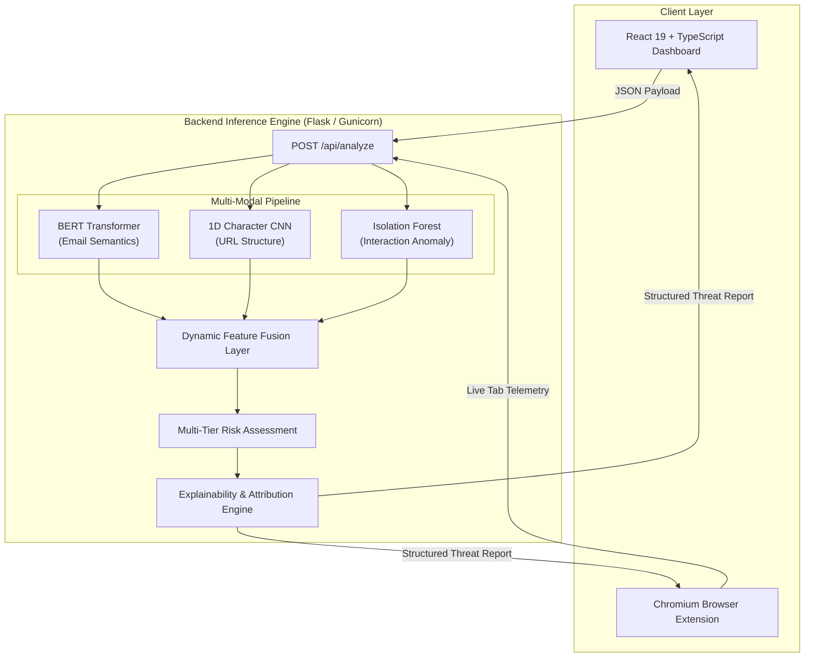

# 🛡️ PhishGuard AI - Multi-Modal Threat & Phishing Intelligence Platform

<p align="center">
  
</p>

<p align="center">
  <strong>Next-Generation Zero-Day Phishing Defense Powered by Deep Contextual NLP, Character CNNs, and Behavioral Anomaly Detection</strong>
</p>

<p align="center">
  
  
  
  
  
  
  
</p>

---

## 📌 Overview

**PhishGuard AI** is an enterprise-grade multi-modal phishing detection ecosystem. Traditional phishing filters rely on static blocklists or simple keyword matching. PhishGuard AI combines three deep learning and machine learning models to analyze multiple attack vectors in real-time:

1. **Email Contextual Semantics**: Fine-tuned **BERT (Transformer)** detecting psychological manipulation, urgency, and coercive language.
2. **URL Structural & Lexical Analysis**: Deep 1D **Convolutional Neural Network (CNN)** inspecting raw character sequences, homoglyphs, and deceptive subdomains.
3. **Behavioral Telemetry**: **Isolation Forest Anomaly Detector** assessing real-time user and page interaction metrics (click velocity, dwell time, typing cadence, focus switches, and redirects).
4. **Dynamic Feature Fusion**: Weighted ensemble aggregating cross-domain signals into a unified, explainable risk score.

---

## 🏗️ System Architecture



---

## ✨ Features

- 🎯 **Multi-Modal Decision Fusion**: Avoids single-point-of-failure detection by synthesizing email, URL, and interaction vectors.
- ⚡ **Real-Time Client Telemetry**: Automatic client-side telemetry tracker with optional manual simulation controls.
- 🔍 **Attribution & Explainability**: Provides human-readable justifications and severity breakdowns (`CRITICAL`, `HIGH`, `MEDIUM`, `LOW`) for every detection.
- 🧪 **Interactive Demo Presets**: Includes pre-loaded real-world attack scenarios (Credential Harvesting, BEC Wire Fraud, and Verified Notices).
- 📋 **1-Click Threat Report Export**: Export structured intelligence summaries directly to clipboard.
- 🌐 **Browser Extension (Manifest V3)**: Real-time background page inspection and credential alert notifications.
- 🐳 **Container Ready**: Production `Dockerfile`s and `docker-compose.yml` for zero-configuration multi-container deployment.

---

## 📁 Repository Structure

```text
Phishing_Detection/
├── backend/                        # Python Flask inference backend
│   ├── app/
│   │   ├── api/routes.py           # REST API endpoints (/analyze, /health)
│   │   ├── explainability/         # Attribution & explanation logic
│   │   ├── fusion/                 # Dynamic feature fusion algorithms
│   │   ├── models/                 # Model training & pipeline definitions
│   │   ├── predictors/             # BERT, CNN & Isolation Forest predictors
│   │   ├── preprocessing/          # Text & URL tokenization routines
│   │   └── risk/                   # Final risk scoring matrices
│   ├── trained_models/             # Pretrained model weights (Git LFS)
│   ├── Dockerfile                  # Production container for backend
│   ├── requirements.txt            # Python runtime dependencies
│   ├── run.py                      # Flask entrypoint & server
│   └── wsgi.py                     # Gunicorn WSGI entrypoint
├── frontend/                       # React 19 + TypeScript + Vite UI
│   ├── public/                     # Static assets & SVG favicon
│   ├── src/
│   │   ├── pages/DetectionPage.tsx # Cyber intelligence dashboard
│   │   ├── services/api.ts         # Strictly typed API client with interceptors
│   │   ├── utils/BehaviorTracker.ts# Client interaction telemetry tracker
│   │   └── index.css               # Futuristic cyber design system
│   ├── Dockerfile                  # Multi-stage Nginx production container
│   ├── package.json
│   ├── vercel.json                 # Vercel SPA routing rewrite rules
│   └── netlify.toml                # Netlify deployment configuration
├── extension/                      # Chromium browser extension (Manifest V3)
├── docker-compose.yml              # Full-stack container orchestration
├── DEPLOYMENT.md                   # Cloud deployment handbook (Render/Vercel/VPS)
└── README.md
```

---

## 🚀 Quick Start (Local Setup)

### Prerequisites
- **Python 3.10+**
- **Node.js 18+** & **npm**
- **Git & Git LFS** (`git lfs install`)

---

### 1. Clone the Repository
```bash
git clone https://github.com/Manishankar-614/phishing_detection.git
cd phishing_detection
git lfs pull
```

---

### 2. Start the Backend Server
```bash
cd backend

# Create & activate a virtual environment (optional)
python -m venv venv
# Windows:
.\venv\Scripts\activate
# Linux/macOS:
source venv/bin/activate

# Install dependencies
pip install -r requirements.txt

# Start the Flask API
python run.py
```
* Backend will be live at: **`http://127.0.0.1:5000`**
* Test API status: `curl http://127.0.0.1:5000/health`

---

### 3. Start the Frontend Dashboard
Open a **second terminal**:
```bash
cd frontend

# Install dependencies
npm install

# Start Vite dev server
npm run dev
```
* Open your browser at: **`http://localhost:5173`**

---

### 4. (Optional) Install Browser Extension
1. Open Google Chrome or Microsoft Edge and navigate to `chrome://extensions` or `edge://extensions`.
2. Toggle on **Developer mode** in the upper right corner.
3. Click **Load unpacked** and select the [`extension/`](file:///c:/Docs/Phishing_Detection/extension) folder.

---

## 🐳 Docker Deployment (1-Command)

Run both the frontend and backend containers together using Docker Compose:

```bash
docker compose up -d --build
```
- **Web Dashboard**: `http://localhost` (Port 80)
- **API Endpoint**: `http://localhost:5000` (Port 5000)

---

## 📡 API Reference

### `POST /api/analyze`
Executes complete multi-modal phishing evaluation.

#### Request Body
```json
{
  "email": "URGENT: Your account has been locked. Verify identity at once.",
  "url": "http://secure-login-portal-verify.bank-auth0-update.xyz/login",
  "is_email_page": false,
  "behavior": {
    "num_clicks": 42,
    "time_on_page": 18.5,
    "num_redirects": 5,
    "failed_logins": 3,
    "mouse_speed": 75.4,
    "typing_speed": 82.1,
    "tab_switches": 8
  }
}
```

#### Response Body
```json
{
  "status": "success",
  "result": {
    "risk": {
      "risk_score": 0.892,
      "risk_percentage": 89.2,
      "risk_level": "critical",
      "classification": "phishing",
      "confidence_percentage": 94.6,
      "recommended_action": "Block connection and isolate domain immediately."
    },
    "email": {
      "email_score": 0.941
    },
    "url": {
      "url_score": 0.915
    },
    "behavior": {
      "behavior_score": 0.820,
      "is_anomaly": true
    },
    "fusion": {
      "fused_score": 0.892,
      "model_agreement": {
        "agreement": "High Consensus"
      }
    },
    "explanation": {
      "summary": "High-confidence phishing threat detected across email language, URL structure, and anomalous interaction metrics.",
      "reasons": [
        {
          "source": "email",
          "severity": "critical",
          "reason": "Extreme coercive urgency and credential harvesting language detected."
        },
        {
          "source": "url",
          "severity": "critical",
          "reason": "Deceptive typosquatting domain structure with high-entropy subdomains."
        }
      ]
    }
  }
}
```

---

## 📖 Deployment Handbooks

Detailed guides for deploying to cloud providers (**Render**, **Railway**, **Vercel**, **AWS**, **GCP**, and **VPS**) are available in [`DEPLOYMENT.md`](file:///c:/Docs/Phishing_Detection/DEPLOYMENT.md).

---

## 🛡️ License

Distributed under the **MIT License**. See `LICENSE` for more details.
